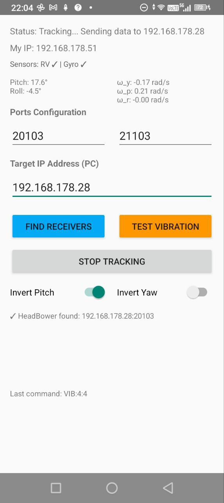

# NITHphoneWrapper - Head Tracking App for Android

**Part of the [NITH Framework](https://neeqstock.notion.site/NITH-framework-1a0de56844cd8099b97df618da497fc1) - A collection of tools for the design of hands-free interaction for people with upper limb disabilities**

A lightweight Android head-tracking application that sends real-time orientation and angular velocity data over UDP to a receiver application. Designed for hands-free head-controlled interfaces. Fully compatible with the NITH framework for multimodal sensing and interaction.

<p align="center">
   
</p>

## Overview

NITHphoneWrapper turns your Android phone into a head-tracking sensor by utilizing the device's rotation vector and gyroscope sensors.

### What is the NITH Framework?

**NITH** is a framework for designing multimodal interactive systems that integrate heterogeneous sensor streams. NITHphoneWrapper is one of several "NITHwrappers" that provide standardized sensor data transmission, enabling seamless integration into NITH-based applications.
This allows for features such as easy source swapping: it doesn't matter from which sensor the data comes from.

For more information about the NITH framework and its ecosystem, see:
- 📘 **NITH Framework Documentation**: https://neeqstock.notion.site/NITH-framework-1a0de56844cd8099b97df618da497fc1

### Key Features

- ✅ **NITH Framework Compatible**: Sends standardized sensor data compatible with NITH receivers
- ✅ **Angular Velocity Rates**: Sends real-time gyroscope angular velocity (yaw/pitch/roll)
- ✅ **Flexible Mounting**: Independent pitch and yaw inversion switches for any phone orientation
- ✅ **Lightweight Protocol**: Efficient UDP-based communication (v0.2.0)
- ✅ **Network Discovery**: Auto-discovery of receiver on local network
- ✅ **Vibration Feedback**: Test vibration to confirm device communication

### To be implemented

- **Drift-free yaw position detection**: Currently the application only sends angular velocity data on the yaw axis, but doesn't properly handle yaw position detection, which requires proper sensor fusion between magnetometer (compass) and gyroscope
- **USB connectivity**: Currently the application only supports UDP connectivity over local Wi-Fi network (including hotspot)

## Hardware Requirements

- **Android Device**: API 24+ (Android 7.0 or later)
- **Sensors Required**:
  - Gyroscope
- **Network**: WiFi or Ethernet connection to a NITH-compatible receiver (e.g., a receiver implementing the [NITHlibrary](https://github.com/LIMUNIMI/NITHlibrary))
- **Permissions**: Internet, Network State, WiFi State, Vibrate

## Installation

### Option 1: Build from Source

```bash
# Clone the repository
git clone https://github.com/LIMUNIMI/NITHphoneWrapper.git
cd NITHphoneWrapper

# Build debug APK
./gradlew assembleDebug

# APK will be generated at:
# app/build/outputs/apk/debug/app-debug.apk
```

### Option 2: Install Pre-built APK

1. Download the latest APK from releases (directly on your device, or transfer it)
2. Enable "Install from Unknown Sources" in Settings > Security
3. Open the APK file and tap Install

## Quick Start Guide

### Step 1: Connect to Network

1. **Open the app** on your Android device
2. **Note your device IP**: Displayed at top as "My IP: X.X.X.X"
3. **Ensure WiFi connection**: Both phone and the receiver must be on the same network

### Step 2: Connect to Receiver

There are **two ways** to connect NITHphoneWrapper to a NITH-compatible receiver:

#### Option A: Automatic Connection (Recommended if supported by the receiver)

1. Ensure your receiver is running and listening on the network
2. Tap **"Find Receivers"** button in the app
3. The app will broadcast your phone's IP address on the network
4. NITH-compatible receivers listening on the standard NITH port (21103) will automatically receive:
   - Your phone's IP address
   - Your listening port number
5. The receiver can then configure itself to receive data from your phone

#### Option B: Manual Configuration

If automatic discovery doesn't work or you need custom settings, manually enter the connection details:

- **Target IP Address**: The IP address of your receiver PC (a NITH-compatible receiver, e.g., one implementing the [NITHlibrary](https://github.com/LIMUNIMI/NITHlibrary))
- **Target Port**: The port the receiver is listening on (default: **20103** - standard NITH data port, can be changed if needed)
- **Listen Port**: This phone's listening port for vibration feedback (default: **21103** - standard NITH discovery port, can be changed if needed)

**Example manual configuration:**
```
Target IP: 192.168.1.100
Target Port: 20103
Listen Port: 21103
```

**Note**: Ports 20103 and 21103 are the standard ports defined by the NITH library specification, but you can customize them if your setup requires different ports.

### Step 3: Start Tracking

1. **Calibrate Mounting Orientation**:
   - Move your head to see current pitch/roll values
   - Tap **"Invert Pitch"** switch if pitch is inverted
   - Tap **"Invert Yaw"** switch if yaw rotation is inverted

2. **Start Tracking**: Tap **"Start Tracking"**
   - Screen will lock to portrait orientation
   - Sensor data will begin updating
   - UDP packets will be sent to the receiver

3. **Monitor Data**:
   - **Left Panel**: Current pitch and roll (degrees)
   - **Right Panel**: Angular velocity for yaw, pitch, and roll (rad/s)

### Vibration Feedback (Optional)

The phone can receive vibration commands from the receiver for haptic feedback:

- The phone listens on the configured **Listen Port** (default: 21103)
- The receiver can send vibration commands in the format: `VIB:<duration>:<amplitude>`
- Example: `VIB:100:200` vibrates for 100ms at intensity 200/255
- Use the **"Test Vibration"** button to test locally (500ms vibration)

For complete vibration command protocol details, see the [Development section](#vibration-commands-receiver--phone).

## Development

### UDP protocol message

#### Message Format

```
$NITHphoneWrapper-v0.2.0|OPR|head_pos_pitch=X.XX&head_pos_roll=X.XX&head_vel_yaw=X.XXXX&head_vel_pitch=X.XXXX&head_vel_roll=X.XXXX^dev=DEVICE&phone_ip=X.X.X.X
```

#### Field Descriptions

| Field | Type | Unit | Range | Description |
|-------|------|------|-------|-------------|
| `head_pos_pitch` | float | degrees | -90 to +90 | Pitch angle (inverted if switch ON) |
| `head_pos_roll` | float | degrees | -180 to +180 | Roll angle |
| `head_vel_yaw` | float | rad/s | ±6.28 | Yaw angular velocity (inverted if switch ON) |
| `head_vel_pitch` | float | rad/s | ±6.28 | Pitch angular velocity |
| `head_vel_roll` | float | rad/s | ±6.28 | Roll angular velocity |

#### Extra fields (non-standard NITH fields)

These fields are included in the app's UDP payload for convenience but are not part of the standardized NITH field set.

| Field | Type | Description |
|-------|------|-------------|
| `dev` | string | Device manufacturer and model (extra field; non-standard NITH) |
| `phone_ip` | string | Phone's IP address (extra field; non-standard NITH) |

#### Why No Yaw Position?

Yaw position inherently drifts when integrated from gyroscope data without magnetometer correction. We're currently searching a solution to integrate correctly magnetometer data from phones that possess that sensor.

### Vibration Commands (Receiver → Phone)

The application listens for vibration commands from the receiver on the configured Listen Port (default: **21103**). This allows the receiver to send haptic feedback to the phone.

#### Command Format

```
$issuer_name-version|COM|vibration_intensity=VALUE&vibration_duration=VALUE^
```

#### Message Structure

| Part | Description | Example |
|------|-------------|---------|
| `$` | Start marker (fixed) | `$` |
| `issuer_name-version` | Name and version of the issuer (e.g., receiver name and version) | `HeadBower-1.0` or `MyApp-2.5` |
| `COM` | Command type (fixed, means "command") | `COM` |
| `vibration_intensity` | Vibration intensity/amplitude (1-255) | `200` |
| `vibration_duration` | Vibration duration in milliseconds (1-10000) | `150` |
| `^` | End marker (fixed) | `^` |

#### Parameters

| Parameter | Type | Range | Description |
|-----------|------|-------|-------------|
| `vibration_intensity` | integer | 1-255 | Vibration amplitude/intensity (1=minimum, 255=maximum). If omitted, uses device default |
| `vibration_duration` | integer (ms) | 1-10000 | Duration of vibration in milliseconds |

#### Examples

```
$HeadBower-1.0|COM|vibration_intensity=200&vibration_duration=100^
$MyReceiver-2.5|COM|vibration_intensity=255&vibration_duration=500^
$TestApp-1.0|COM|vibration_intensity=128&vibration_duration=50^
```

#### Notes

- The issuer name is parsed and displayed in the app (in the "Last command" field)
- Command parsing is case-insensitive for field names
- Intensity values outside 1-255 are clamped to the device default
- Duration values outside 1-10000 ms are rejected
- Both `vibration_intensity` and `vibration_duration` parameters are required
- Send vibration commands via UDP to the phone's IP address on the Listen Port
- On Android 8.0+ (API 26+), the amplitude parameter is used; on older devices, only duration is applied

### Dependencies

- **Android SDK**: API 24+
- **AndroidX**: Core, AppCompat, ConstraintLayout
- **Kotlin Runtime**: Optional (build includes Kotlin support)
- **Gradle**: 8.10.0 or later

### Building from Source

```bash
# Requirements
# - Java 11+ (or Android Studio's bundled JBR)
# - Gradle 8.10.0+

# Build debug APK
./gradlew assembleDebug

# Build release APK (requires keystore)
./gradlew assembleRelease

# Run tests
./gradlew test

# Clean build
./gradlew clean
```

## License

See LICENSE file for details.

## Support

For issues, feature requests, or contributions:
1. Check existing issues on GitHub
2. Provide device model and Android version
3. Include sensor availability information from app status
4. Describe expected vs actual behavior

## Contributing

Contributions are welcome! Please:
1. Fork the repository
2. Create a feature branch
3. Follow existing code style
4. Test on multiple devices if possible
5. Submit a pull request